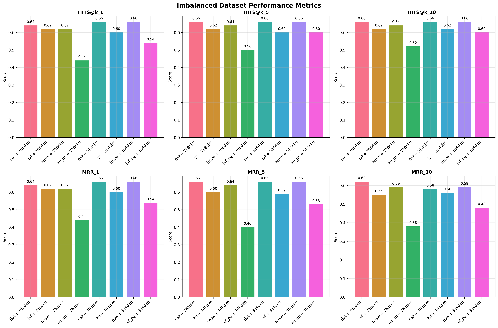
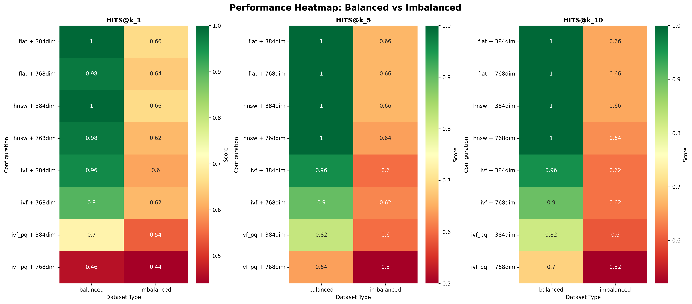

# Shopping Catalog Vector Search

This project implements a vector search solution on top of shopping catalog data sourced from [esci-data](https://github.com/amazon-science/esci-data), and also reports quality for the various approaches and data subsets

## Prerequisites

*   Python 3.12

## Setup

1.  **Navigate to the project directory:**
    ```bash
    cd Shopping-catalog-vector-search
    ```

2.  **Create and activate a virtual environment (recommended):**
    ```bash
    python -m venv venv
    # On Windows
    venv\Scripts\activate
    # On macOS/Linux
    source venv/bin/activate

3.  **Install Python dependencies:**
    ```bash
    pip install -r requirements.txt
    ```

4. Download Source dataset

```bash
cd ../
git clone https://github.com/amazon-science/esci-data.git
cd esci-data
git lfs pull
cd  Shopping-catalog-vector-search
cp  ../esci-data/shopping_queries_dataset/shopping_queries_dataset_examples.parquet  ./dataset/source_files/shopping_queries_dataset_examples.parquet
cp  ../esci-data/shopping_queries_dataset/shopping_queries_dataset_products.parquet  ./dataset/source_files//shopping_queries_dataset_products.parquet
```

# Creating Sample Dataset
Notebook:  notebooks/create_dataset.ipynb

Workflow followed:
1. From the file "shopping_queries_dataset_examples.parquet", selected rows with "product_locale" as "us" and "esci_label" as "E"
2. Then 50 unique queries sampled from the data selected above in step 1
3. With above sampled 50 unique queries, sampled a dataset of 11 or 10 records per query, resulting in total of 500 rows with unique "product_id" values
4. For the product_id dataset created in Step 3, selected corresponding product details from file "shopping_queries_dataset_products.parquet", to create a dataset with columns as  "product_id","product_title", "product_description","product_bullet_point","product_brand","product_color" , as dataset for embedding

Above dataset has all the 50 queries represented equally in dataset of 500 rows.

To test Out of distribution performance for the queries corresponding to products which are not indexed, with only change in Step 3 above, where selected maximum records per query, resulting in 33 queries represented in datset of 500 rows.

Now above exercise yields two datasets (dataset/sampled_dataset folder):

- sampled_datavals_product_data.parquet 
   This dataset contains 500 rows, with 50 unique queries represented
- sampled_datavals_product_data_imbalanced.parquet 
   This dataset contains 500 rows, with 33 unique queries represented


## Sampled Dataset Stats for determining Embedding dimensions
Notebook: notebooks/dataset/stats.ipynb

1. For the file "sampled_datavals_product_data", ran some stats around text representations
2. For following columns "product_title","product_description","product_bullet_point","product_brand","product_color", here are some stats

```bash
Creating combined text representations...
Combined text statistics:
  Average length: 221.13 words
  Std deviation: 161.93 words
  Min length: 3 words
  Max length: 691 words
```

Above stats does give an indication as best model to use for embeddings will be 768 dimensions

3. For the combined text representation of following columns "product_title","product_bullet_point","product_brand","product_color" , here are some stats

```bash
Combined text statistics:
  Average length: 141.80 words
  Std deviation: 90.17 words
  Min length: 3 words
  Max length: 448 words
```

Above stats does give an indication as best model to use for embeddings will be less than 400 dimension like 384 dimension.


# Embedding Models used

1.  "intfloat/multilingual-e5-base"

Dimensions: 768
Used for : Combined text representation of ["product_title","product_description","product_bullet_point","product_brand","product_color"]
Reasons for using this model:
 - Its large variant is top performing model for retrieval on https://huggingface.co/spaces/mteb/leaderboard, and that too with its smaller param footprint
 - Used base model for its embedding dims of 768, which as per the stats obtained in previous section, is going to be enough for this dataset

2.  "intfloat/multilingual-e5-small"

Dimensions: 384
Used for : Combined text representation of ["product_title","product_bullet_point","product_brand","product_color"]
Reasons for using this model:
 - Its large variant is top performing model for retrieval on https://huggingface.co/spaces/mteb/leaderboard, and that too with its smaller param footprint
 - Used base model for its embedding dims of 384, which as per the stats obtained in previous section, is going to be enough for this dataset

 ## Create embeddings for vector indexing
 In the parent directory of the project, in commnad line run following:

 ```bash
 python src/embed_dataset.py
 ```
Now running command above, will create embedding indices in folder  "embedding_indices/balanced_dataset" and "embedding_indices/imbalanced_dataset", with following indexes:

- all_product_fields_768dim_embeddings.npy 
    Data embedded: combined text representation of ["product_title","product_description","product_bullet_point","product_brand","product_color"]
    Embedding dimensions: 768
    Model used: "intfloat/multilingual-e5-base"

- product_fields_exclude_desc_384dim_embeddings.npy : 
    Data embedded: combined text representation of ["product_title","product_bullet_point","product_brand","product_color"]
    Embedding dimensions: 384
    Model used: "intfloat/multilingual-e5-small"


# Creating Vector indexes

In the root directory of project run the following:

```bash
python src/create_vector_indexes.py
```
Indexes created:

1. Folder: vector_indexes/768dim
   Embeddings used: embeddings_generated/all_product_fields_768dim_embeddings.npy  

2. Folder: vector_indexes/384dim
   Embeddings used: embeddings_generated/product_fields_exclude_desc_384dim_embeddings.npy

Now in both the indexes folder above, following algorithms used for creating indexes
1. IndexFlatIP : 
   - Create FAISS Flat index (exact search with inner product/cosine similarity).
   - serves as ground truth baseline
   - essential for measuring how much accuracy you sacrifice with approximate methods
   - Indexes generated with suffix "_flat.index"
2. IndexIVFFlat and IndexFlatIP: 
   - Create FAISS IVF (Inverted File) index for faster approximate search, with IndexFlatIP serving as quantizer
   - represents the classic clustering approach, perfect for studying recall-speed tradeoffs and understanding traditional approximate search behavior
   - Indexes generated with suffix "_ivf.index"
3. IndexHNSWFlat:
   - Create FAISS HNSW (Hierarchical Navigable Small World) index
   - gives state-of-the-art performance
   - relevant for high-dimensional semantic embeddings where graph-based methods excel.
   - Indexes generated with suffix "_hnsw.index"
4. IndexIVFPQ and IndexFlatIP:
   - Create FAISS IVF+PQ index combining clustering and compression, with IndexFlatIP serving as quantizer
   - Preferrable for large datasets with memory constraints, used here to see value it provides 
   - Indexes generated with suffix "_ivf_pq.index"


# Evaluations

## Running evaluation
```bash
python src/evaluate_indexes.py
```
It generates evaluation results to an excel file at "metrics/metrics.xlsx"

## Metrics

Following metrics used:

1.  HITS@k : 
- also known as Recall@K, measures whether at least one relevant item appears in the top K retrieved results.
- take values between 0 and 1, where higher values mean better performance
- used here for top1, top5, top10 results represented by  HITS@k_1, HITS@k_5, HITS@k_10

2. MRR@k
- MRR (Mean Reciprocal Rank) provides rank-aware evaluation
- It measures "Where is the first relevant item?" , rewarding systems that place relevant items higher in the ranking
- Formula: MRR = Average(1/rank_of_first_relevant_item)
- used here for top1, top5, top10 results represented by  MRR_1, MRR_5, MRR_10
 
 3. Time took to query index - it was milliseconds, so didn't mentioned its breakdown below

 ## Evaluation variants

 1. Balanced dataset

 - It is balanced which means, all the unique 50 queries are represented in the 500 records dataset indexed for vector search
 - In the evaluation, all the 50 queries will be evaluated, corresponding to which 500 records indexed

    i) all_product_fields_768dim_embeddings :  
      - Combined representation of product fields (["product_title","product_description","product_bullet_point","product_brand","product_color"]) embedded with "intfloat/multilingual-e5-base"
      - Evaluated following indexes 
        - flat
        - ivf
        - hnsw
        - ivf_pq

    ii) product_fields_exclude_desc_384dim_embeddings
      - Combined representation of product fields (["product_title","product_bullet_point","product_brand","product_color"]) embedded with "intfloat/multilingual-e5-small"
      - Evaluated following indexes 
        - flat
        - ivf
        - hnsw
        - ivf_pq

 2. Imbalanced dataset

 - It is imbalanced which means, only 33 of the 50 unique queries are represented in the 500 records dataset indexed for vector search
 - In the evaluation, all the 50 queries will be evaluated, to see the index performance on the queries for which products are not indexed.

    i) all_product_fields_768dim_embeddings :  
    - Combined representation of product fields (["product_title","product_description","product_bullet_point","product_brand","product_color"]) embedded with "intfloat/multilingual-e5-base"
    - Evaluated following indexes 
        - flat
        - ivf
        - hnsw
        - ivf_pq

    ii) product_fields_exclude_desc_384dim_embeddings
    - Combined representation of product fields (["product_title","product_bullet_point","product_brand","product_color"]) embedded with "intfloat/multilingual-e5-small"
    - Evaluated following indexes 
        - flat
        - ivf
        - hnsw
        - ivf_pq

## Running evaluation results visualisation
```bash
python src/metrics_visualisation.py
```
It will generate metrics to a excel file located in metrics/metrics.xlsx


## Evaluation results plots

### Balanced dataset performance

- Balanced dataset shows significantly higher performance across all metrics
- FLAT and HNSW index types perform best for balanced datasets
- IVF_PQ shows the lowest performance, especially on imbalanced data
- 384dim embeddings (exclude desc) often match or exceed 768dim performance
- plot shown below:


### Imbalanced dataset performance

- For 768 dim, except ivp_pq, all the index types exhibit almost same performance
- 768 dim indexes perform better across most of the metrics@k, as compared to 384 dim indexes
- plot shown below:



### Dataset comparison
- Balanced dataset performance is significantly better than imbalanced dataset
- Imbalanced dataset can be attributed to for major chunk of evaluated queries, there are no corresponding products indexed in vector index.
- plot shown below:


### Performance summary

1. Balanced Dataset - Best Performers:
- HITS@k_1: flat + 384dim (1.000)
- HITS@k_5: flat + 768dim, hnsw + 768dim, flat + 384dim, hnsw + 384dim (1.000)
- HITS@k_10: flat + 768dim,hnsw + 768dim, flat + 384dim,hnsw + 384dim (1.000)

2. Imbalanced Dataset - Best Performers:
- HITS@k_1: flat + 384dim, hnsw + 384dim (0.660)
- HITS@k_5: flat + 768dim, flat + 384dim, hnsw + 384dim (0.660)
- HITS@k_10: flat + 768dim, flat + 384dim, hnsw + 384dim (0.660)

- Performance comparison in the plot below:




### Debugging Low performance on imabalanced dataset
Notebook: debug_imbalanced_dataset_metrics.ipynb

For the 17 queries out of 50 queries that were missing in imbalanced dataset, there were no matches, with metrics:
HITS@10 (average) : 0
HITS@5 (average) : 0
HITS@1 (average) : 0

For the common queries, with many of those overrepresented, performance was as expected higher:
HITS@10 (average) : 0.97
HITS@5 (average) : 0.97
HITS@1 (average) : 0.94


## Overall insights:

1. Optimal product data fields
 - All product fields, excluding "product_description" (["product_title","product_bullet_point","product_brand","product_color"]) did resulted in better evaluation metrics and are recommended as best

2. Embedding model choice
 - Because of the smaller text representation for product data fields selected, a smaller embedding model "intfloat/multilingual-e5-small" is preferrable.

 3. Balanced vs Imbalanced dataset
 - When all the products being evaluated are indexed, that provided better metrics as compared to the case of imbalanced dataset, where majority of queries evaluated didn't have corresponding products indexed.

 4. Best Indexing algorithm
 - Across both balanced and imbalanced dataset, HNSW consistently outperformed other indexing algorithms, so that'll be preferred indexing algorithm.
